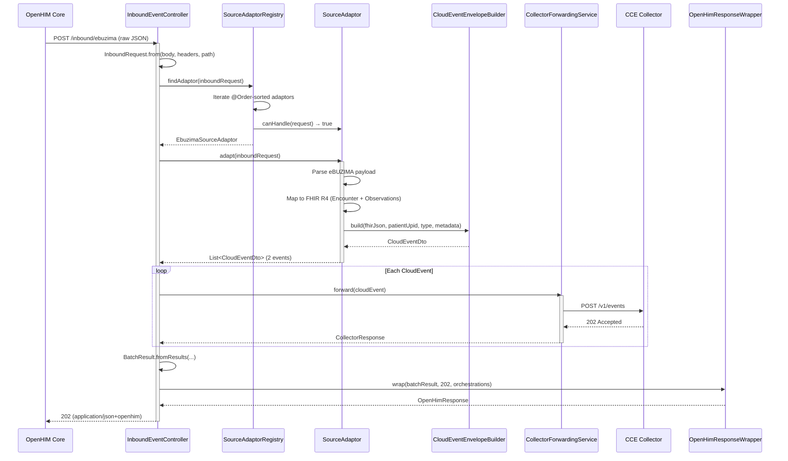
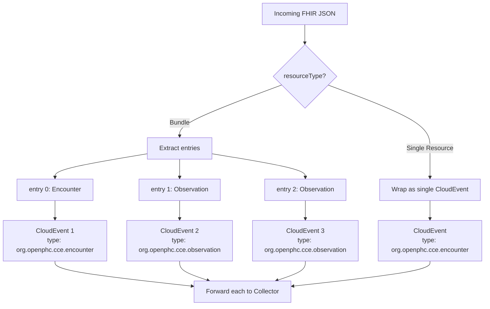
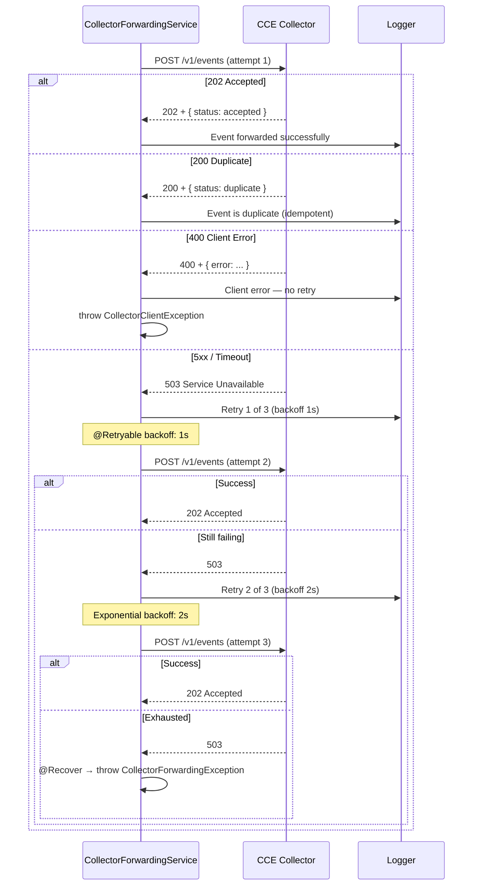
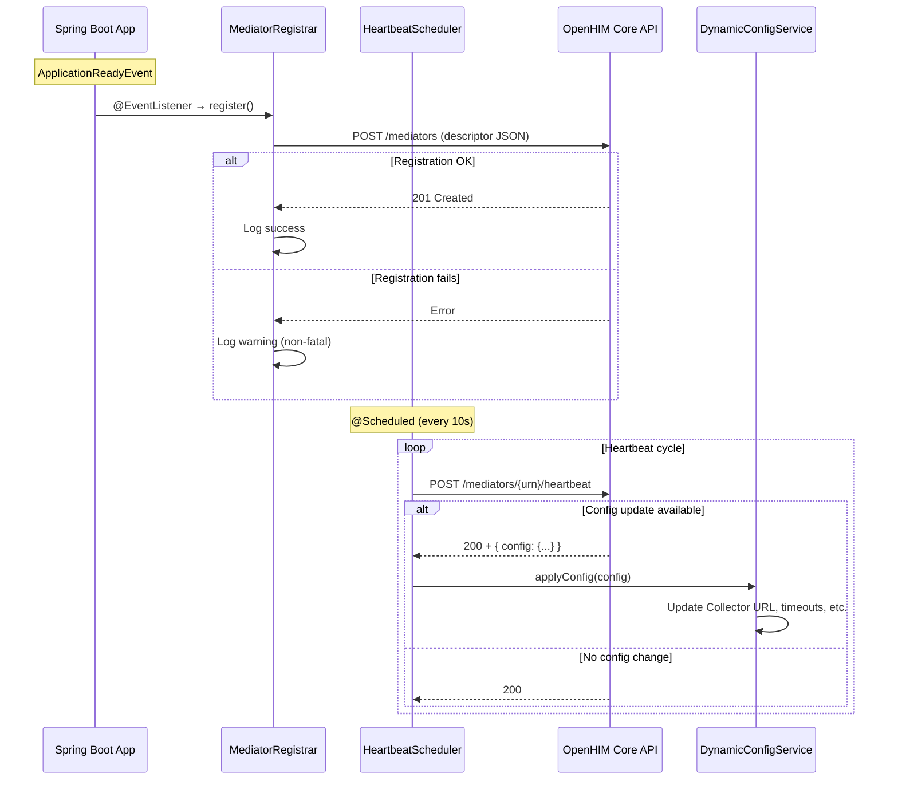
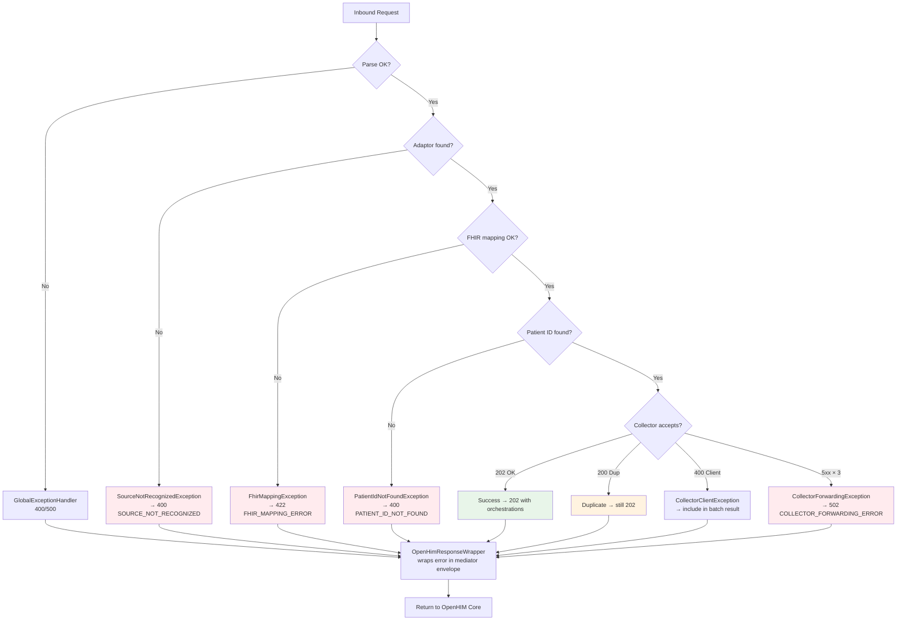
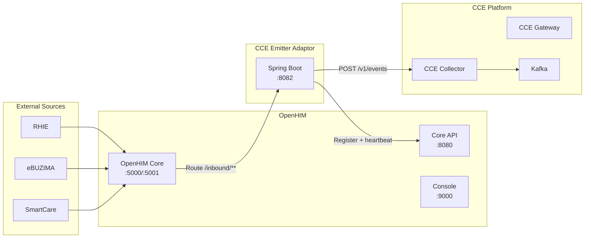

# CCE Emitter Adaptor — Flow Diagrams

All diagrams use Mermaid notation.

## 1. End-to-End Event Flow

```mermaid
flowchart LR
    subgraph Sources
        RHIE[RHIE<br/>FHIR R4]
        EBZ[eBUZIMA<br/>Custom JSON]
        SC[SmartCare]
        CHW[CHW App]
        LAB[Lab]
    end

    subgraph OpenHIM
        OHC[OpenHIM Core<br/>Channel Router]
    end

    subgraph "CCE Emitter Adaptor (Spring Boot)"
        CTRL[InboundEvent<br/>Controller]
        REG[SourceAdaptor<br/>Registry]
        SA[SourceAdaptor<br/>adapt]
        NORM[CloudEvent<br/>Builder]
        FWD[Collector<br/>Forwarding<br/>@Retryable]
        WRAP[OpenHIM<br/>ResponseWrapper]
    end

    subgraph CCE
        COL[CCE Collector]
        KAFKA[Kafka<br/>cce.events.inbound]
    end

    RHIE -->|FHIR JSON| OHC
    EBZ -->|Custom JSON| OHC
    SC --> OHC
    CHW --> OHC
    LAB --> OHC

    OHC -->|Route to mediator| CTRL
    CTRL --> REG
    REG --> SA
    SA --> NORM
    NORM --> FWD
    FWD -->|POST /v1/events| COL
    COL --> KAFKA

    FWD --> WRAP
    WRAP -->|application/json+openhim| OHC
```

## 2. Request Processing Sequence



## 3. Adaptor Selection Flow

```mermaid
flowchart TD
    A[POST /inbound/**] --> B{X-Source-System<br/>header present?}

    B -->|"ebuzima"| C[EbuzimaSourceAdaptor<br/>@Order 10]
    B -->|"smartcare"| D[SmartCareSourceAdaptor<br/>@Order 20]
    B -->|"chw"| E[ChwAppSourceAdaptor<br/>@Order 30]
    B -->|"lab"| F[LabSystemSourceAdaptor<br/>@Order 40]
    B -->|not set| G{URL Path?}

    G -->|/inbound/ebuzima| C
    G -->|/inbound/smartcare| D
    G -->|/inbound/chw| E
    G -->|/inbound/lab| F
    G -->|"/inbound or /inbound/fhir"| H{Body contains<br/>resourceType?}

    H -->|Yes| I[RhieSourceAdaptor<br/>@Order 100<br/>FHIR Passthrough]
    H -->|No| J[SourceNotRecognized<br/>Exception → 400]

    style C fill:#e1f5fe
    style D fill:#e1f5fe
    style E fill:#e1f5fe
    style F fill:#e1f5fe
    style I fill:#e8f5e9
    style J fill:#ffebee
```

## 4. FHIR Bundle Expansion



## 5. Collector Forwarding with Retry



## 6. OpenHIM Registration & Heartbeat Lifecycle



## 7. Error Handling Flow



## 8. Component Dependency Graph

```mermaid
flowchart TD
    CTRL[InboundEventController]
    NORM[EventNormalizationService]
    REG[SourceAdaptorRegistry]
    FWD[CollectorForwardingService]
    WRAP[OpenHimResponseWrapper]

    SA_RHIE[RhieSourceAdaptor]
    SA_EBZ[EbuzimaSourceAdaptor]
    SA_SC[SmartCareSourceAdaptor]
    SA_CHW[ChwAppSourceAdaptor]
    SA_LAB[LabSystemSourceAdaptor]

    CE[CloudEventEnvelopeBuilder]
    ETN[EventTypeNormalizer]
    PIE[PatientIdExtractor]
    FRP[FhirResourceParser]
    IDG[EventIdGenerator]

    REG_HB[MediatorRegistrar]
    HB[HeartbeatScheduler]
    DC[DynamicConfigService]

    FC[FhirConfig<br/>@Bean FhirContext]
    RC[RestClientConfig<br/>@Bean RestClient]

    CTRL --> NORM
    CTRL --> FWD
    CTRL --> WRAP

    NORM --> REG
    REG --> SA_RHIE
    REG --> SA_EBZ
    REG --> SA_SC
    REG --> SA_CHW
    REG --> SA_LAB

    SA_RHIE --> CE
    SA_RHIE --> PIE
    SA_EBZ --> CE
    SA_EBZ --> PIE

    CE --> ETN
    CE --> IDG

    FWD --> RC
    REG_HB --> RC
    HB --> RC
    HB --> DC

    SA_RHIE --> FC
    SA_EBZ --> FC
    FRP --> FC

    style CTRL fill:#bbdefb
    style WRAP fill:#bbdefb
    style FWD fill:#c8e6c9
    style REG fill:#fff9c4
    style REG_HB fill:#e1bee7
    style HB fill:#e1bee7
```

## 9. Deployment Topology


