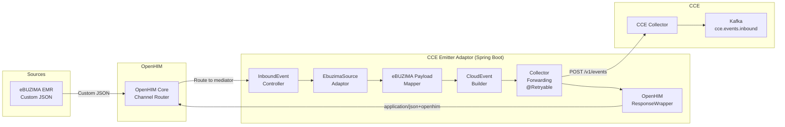
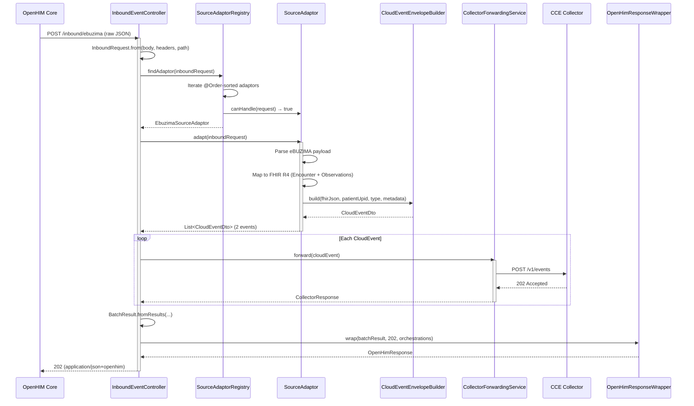
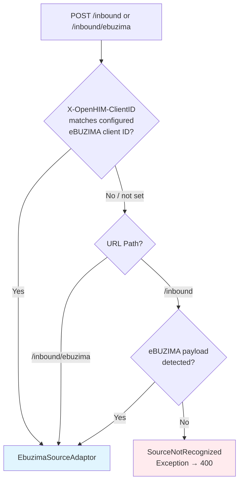
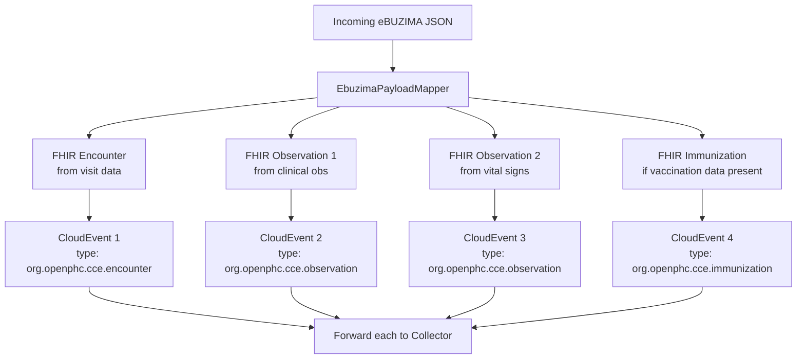
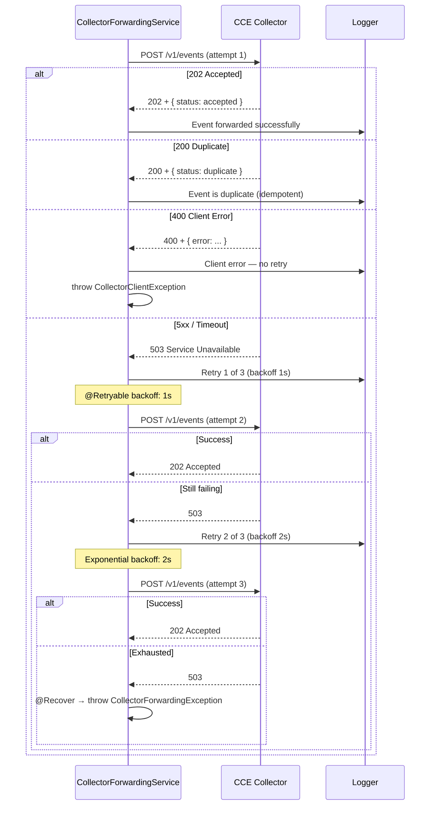
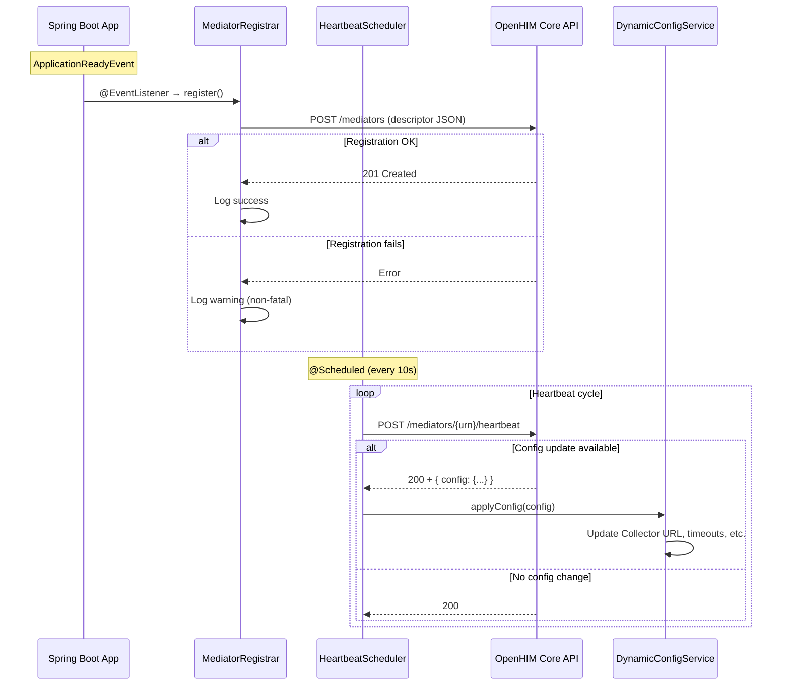
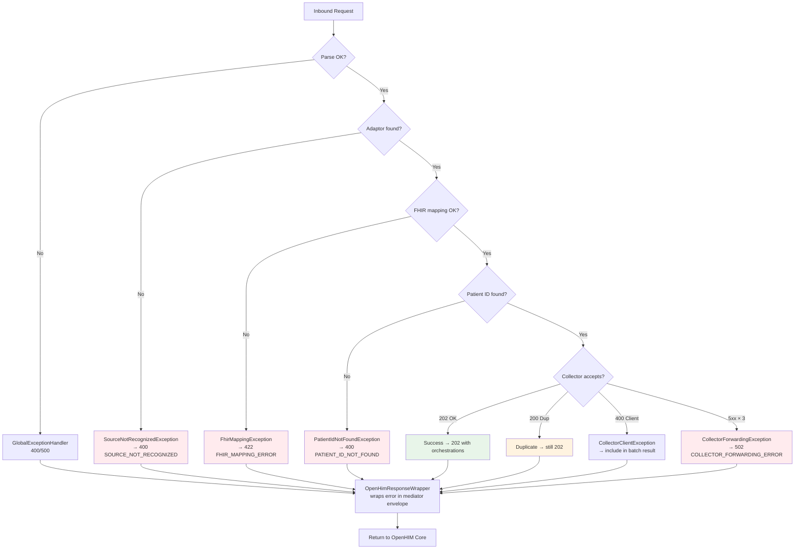
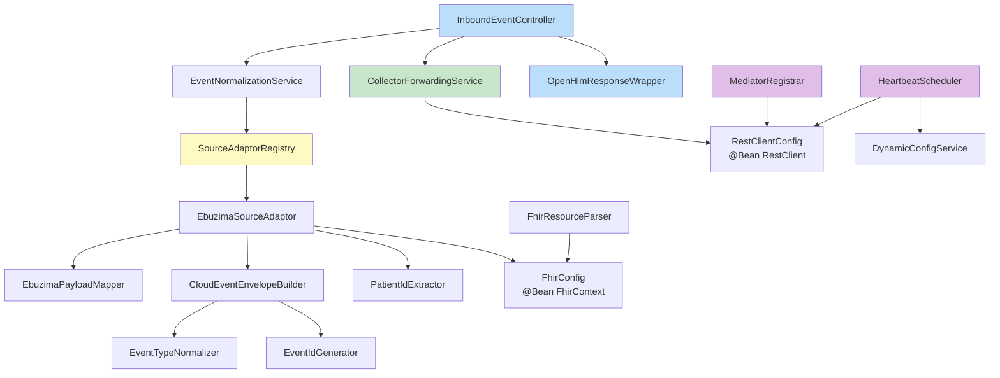
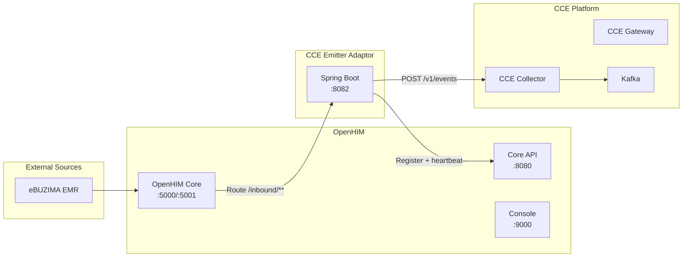

# CCE Emitter Adaptor — Flow Diagrams

All diagrams use Mermaid notation.

## 1. End-to-End Event Flow

## 2. Request Processing Sequence

## 3. Adaptor Selection Flow

## 4. eBUZIMA Payload Expansion

## 5. Collector Forwarding with Retry

## 6. OpenHIM Registration & Heartbeat Lifecycle

## 7. Error Handling Flow

## 8. Component Dependency Graph

## 9. Deployment Topology

