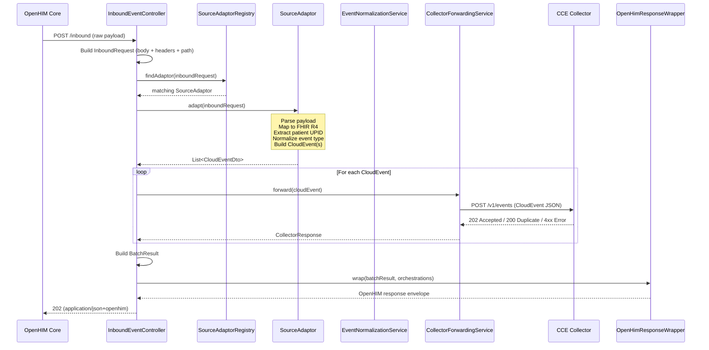
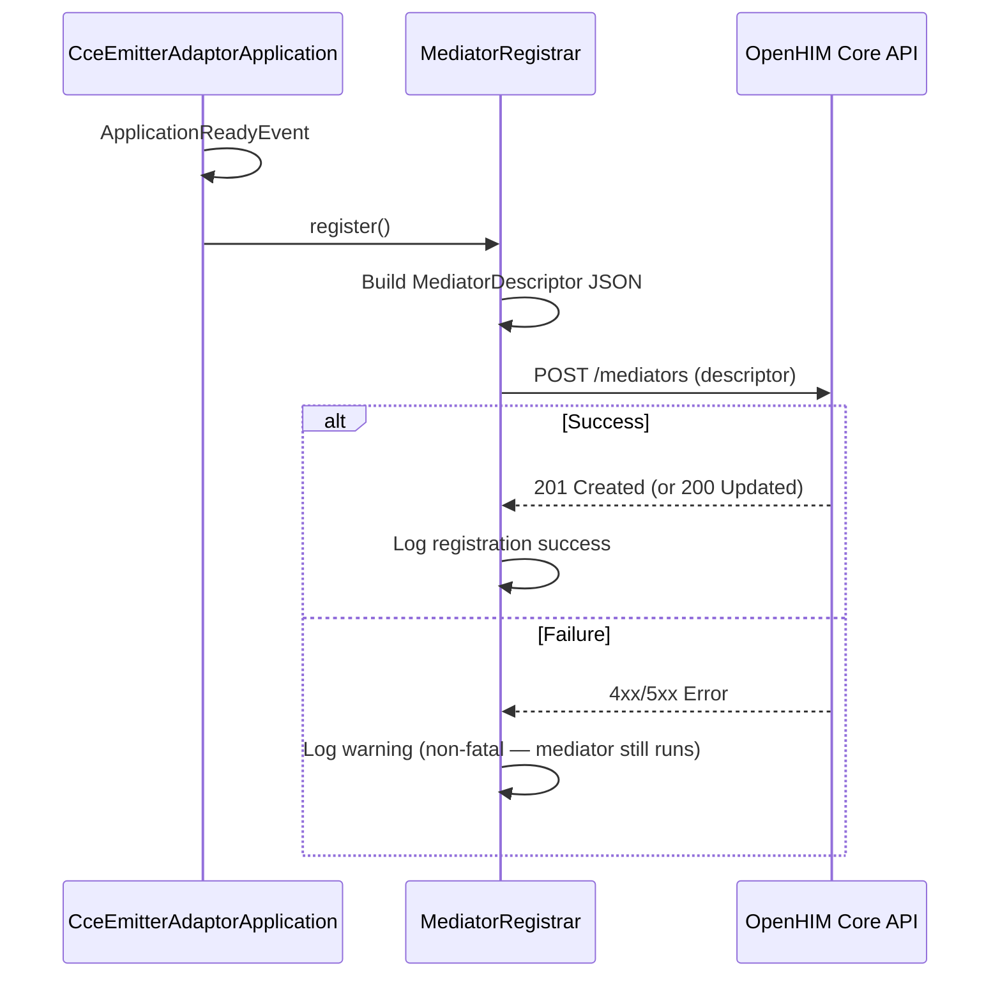
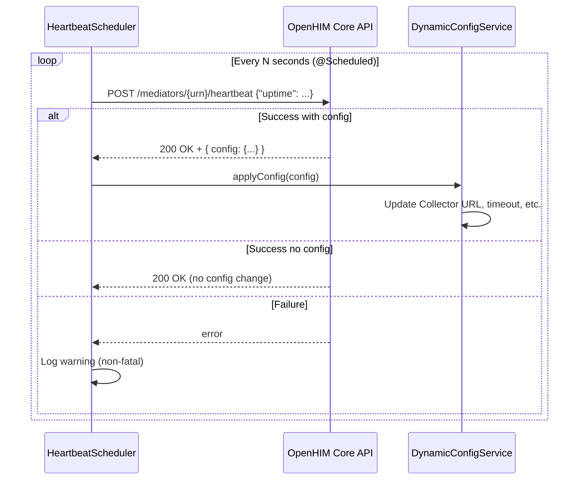
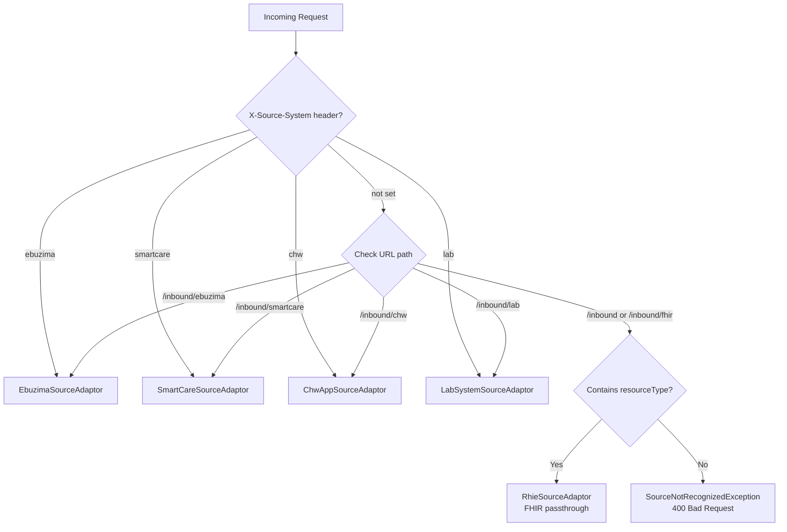

# CCE Emitter Adaptor — High-Level Design (HLD)

## 1. Design Philosophy

The Emitter Adaptor is a standard **Spring Boot 3.x** microservice that implements the OpenHIM mediator contract through custom Spring components. It avoids third-party mediator libraries in favor of clean, maintainable Spring idioms — `@RestController` for routing, `RestClient` for outbound HTTP, `@Scheduled` for heartbeats, `@ConfigurationProperties` for type-safe config.

## 2. Subsystem Decomposition

### 2.1 Subsystems

```
┌───────────────────────────────────────────────────────────────────┐
│                    CCE Emitter Adaptor                             │
│                                                                   │
│  ┌────────────────────┐  ┌──────────────────────────────────┐    │
│  │ OpenHIM Integration │  │ Request Processing Pipeline       │    │
│  │                     │  │                                   │    │
│  │ • MediatorRegistrar │  │ InboundEventController            │    │
│  │ • HeartbeatScheduler│  │   ↓                               │    │
│  │ • DynamicConfigSvc  │  │ SourceAdaptorRegistry             │    │
│  │ • ResponseWrapper   │  │   ↓ (find matching adaptor)       │    │
│  └────────────────────┘  │ SourceAdaptor.adapt()              │    │
│                           │   ↓ (FHIR parse + map)            │    │
│  ┌────────────────────┐  │ EventNormalizationService          │    │
│  │ Source Adaptors     │  │   ↓ (build CloudEvent envelope)   │    │
│  │                     │  │ CollectorForwardingService         │    │
│  │ • RhieAdaptor       │  │   ↓ (POST via RestClient)         │    │
│  │ • EbuzimaAdaptor    │  │ OpenHimResponseWrapper             │    │
│  │ • SmartCareAdaptor  │  │   ↓ (wrap in openhim format)      │    │
│  │ • ChwAppAdaptor     │  └──────────────────────────────────┘    │
│  │ • LabAdaptor        │                                          │
│  └────────────────────┘  ┌──────────────────────────────────┐    │
│                           │ Observability                     │    │
│  ┌────────────────────┐  │                                   │    │
│  │ Configuration       │  │ • Actuator (health, readiness)   │    │
│  │                     │  │ • Micrometer (Prometheus export)  │    │
│  │ • application.yml   │  │ • SLF4J + Logback (structured)   │    │
│  │ • @ConfigProperties │  └──────────────────────────────────┘    │
│  │ • Dynamic via HB    │                                          │
│  └────────────────────┘                                          │
└───────────────────────────────────────────────────────────────────┘
```

### 2.2 Subsystem Descriptions

| Subsystem | Components | Responsibility |
|-----------|-----------|----------------|
| **OpenHIM Integration** | `MediatorRegistrar`, `HeartbeatScheduler`, `DynamicConfigService`, `OpenHimResponseWrapper` | Mediator lifecycle: register on startup, heartbeat for health + config sync, wrap responses in OpenHIM format |
| **Request Processing** | `InboundEventController`, `EventNormalizationService`, `CollectorForwardingService` | Receive HTTP → transform → forward pipeline |
| **Source Adaptors** | `SourceAdaptor` implementations (one per source system) | Source-specific payload parsing and FHIR R4 mapping |
| **Configuration** | `OpenHimProperties`, `CollectorProperties`, `FhirConfig`, `RestClientConfig` | Type-safe Spring configuration, `RestClient` beans, `FhirContext` singleton |
| **Observability** | Spring Boot Actuator, Micrometer counters/timers, structured logging | Health probes, Prometheus metrics, JSON log output |

## 3. Request Processing Pipeline

### 3.1 Sequence Diagram



### 3.2 Processing Steps

| Step | Component | Description |
|------|-----------|-------------|
| 1 | `InboundEventController` | Receives HTTP POST, extracts body, headers, path |
| 2 | `InboundRequest.from()` | Wraps raw data into domain object with `SourceMetadata` |
| 3 | `SourceAdaptorRegistry.findAdaptor()` | Iterates registered `@Component` adaptors; first `canHandle()` match wins |
| 4 | `SourceAdaptor.adapt()` | Parses source payload, maps to FHIR R4, builds `List<CloudEventDto>` |
| 5 | `CollectorForwardingService.forward()` | POSTs each CloudEvent to Collector via `RestClient`; `@Retryable` on 5xx |
| 6 | `OpenHimResponseWrapper.wrap()` | Wraps response + orchestration log in `application/json+openhim` format |
| 7 | Controller returns | `ResponseEntity` with OpenHIM envelope |

## 4. OpenHIM Integration Subsystem

### 4.1 Registration Flow



### 4.2 Heartbeat Flow



### 4.3 Response Wrapping

Every response from the adaptor is wrapped in the OpenHIM mediator response format:

```json
{
  "x-mediator-urn": "urn:mediator:cce-emitter-adaptor",
  "status": "Successful",
  "response": {
    "status": 202,
    "headers": { "Content-Type": "application/json" },
    "body": "{\"eventsProcessed\":2,\"eventsAccepted\":2,...}",
    "timestamp": "2026-02-25T08:00:05Z"
  },
  "orchestrations": [
    {
      "name": "Forward to CCE Collector",
      "request": { "method": "POST", "path": "/v1/events", "body": "..." },
      "response": { "status": 202, "body": "..." },
      "timestamp": "2026-02-25T08:00:04Z"
    }
  ]
}
```

## 5. Source Adaptor Subsystem

### 5.1 Adaptor Discovery

All `SourceAdaptor` implementations are Spring `@Component` beans. `SourceAdaptorRegistry` receives them via `@Autowired List<SourceAdaptor>`, ordered by `@Order` annotation. `RhieSourceAdaptor` has the lowest priority (fallback).

### 5.2 Adaptor Selection



### 5.3 FHIR Mapping

| Source | Mapping Complexity | Output |
|--------|-------------------|--------|
| RHIE | Passthrough — already FHIR R4 | Same resource, extracted from Bundle if needed |
| eBUZIMA | Complex mapping — `EbuzimaPayloadMapper` | Encounter + Observations + Immunizations |
| SmartCare | Moderate — HL7v2/FHIR normalization | Standard FHIR R4 resources |
| CHW App | Moderate mapping — simplified JSON | FHIR R4 Encounter + Observations |
| Lab | Moderate mapping | FHIR DiagnosticReport + Observations |

## 6. Collector Forwarding Subsystem

### 6.1 Forwarding with Spring Retry

```java
@Service
@RequiredArgsConstructor
public class CollectorForwardingService {

    private final RestClient collectorClient;
    private final CollectorProperties properties;

    @Retryable(
        retryFor = {CollectorForwardingException.class},
        maxAttempts = 3,
        backoff = @Backoff(delay = 1000, multiplier = 2.0)
    )
    public CollectorResponse forward(CloudEventDto event) {
        return collectorClient.post()
            .uri(properties.getEventsPath())
            .contentType(MediaType.APPLICATION_JSON)
            .body(event)
            .retrieve()
            .body(CollectorResponse.class);
    }
}
```

### 6.2 Retry Strategy

| Collector Response | Retry? | Adaptor Action |
|--------------------|--------|---------------|
| 202 Accepted | No | Success |
| 200 Duplicate | No | Record as duplicate |
| 400 Bad Request | **No** | Client error — adaptor bug (missing `type`) |
| 422 Unprocessable | **No** | Client error — do not retry |
| 500 Server Error | **Yes** | Retry with exponential backoff |
| 503 Unavailable | **Yes** | Retry with exponential backoff |
| Timeout | **Yes** | Retry with exponential backoff |

## 7. Configuration Hierarchy

```
┌─────────────────────────────────────┐
│ Highest Priority                     │
│                                      │
│  1. Dynamic Config (OpenHIM Console) │  ← synced via heartbeat
│  2. Environment Variables            │  ← SPRING_APPLICATION_JSON, --server.port
│  3. Profile-specific YAML            │  ← application-prod.yml
│  4. application.yml                  │  ← default config
│                                      │
│ Lowest Priority                      │
└─────────────────────────────────────┘
```

## 8. Deployment Model

```
┌──────────────────────────────────────┐
│        Container / VM                 │
│                                       │
│  ┌───────────────────────────────┐   │
│  │  java -jar                     │   │
│  │  cce-emitter-adaptor.jar       │   │
│  │                                │   │
│  │  Port: 8082                    │   │
│  │  Health: /actuator/health      │   │
│  │  Liveness: /actuator/health/   │   │
│  │           liveness             │   │
│  │  Readiness: /actuator/health/  │   │
│  │            readiness           │   │
│  │  Metrics: /actuator/prometheus │   │
│  └───────────────────────────────┘   │
│                                       │
│  Environment Variables:               │
│   OPENHIM_CORE_HOST=openhim-core      │
│   CCE_COLLECTOR_URL=http://collector  │
│   SPRING_PROFILES_ACTIVE=prod         │
└──────────────────────────────────────┘
```

### Health Probes

| Probe | Endpoint | Check |
|-------|----------|-------|
| Liveness | `/actuator/health/liveness` | JVM alive |
| Readiness | `/actuator/health/readiness` | Collector reachable, OpenHIM registered |
| Startup | `/actuator/health` | Application context loaded |

## 9. Security

| Concern | Mechanism |
|---------|-----------|
| **OpenHIM ↔ Mediator** | OpenHIM Core routes requests; mediator trusts OpenHIM channel auth |
| **Mediator → OpenHIM Core API** | Basic auth (`root@openhim.org` / password) for registration + heartbeat |
| **Mediator → CCE Collector** | Via CCE Gateway (OAuth scope: `events:write`) — token managed externally or passed through |
| **TLS** | HTTPS connections configurable via Spring Boot `server.ssl.*` properties |
