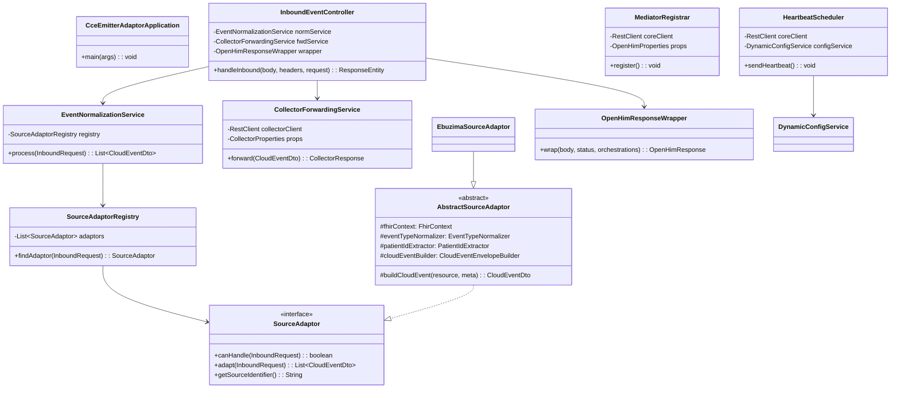

# CCE Emitter Adaptor — Low-Level Design (LLD)

## 1. Package Structure

```
org.openphc.cce.emitter
├── CceEmitterAdaptorApplication.java               # @SpringBootApplication
│
├── config/
│   ├── FhirConfig.java                              # @Bean FhirContext.forR4() singleton
│   ├── RestClientConfig.java                        # @Bean RestClient for Collector + OpenHIM Core
│   ├── RetryConfig.java                             # @EnableRetry + configuration
│   ├── OpenHimProperties.java                       # @ConfigurationProperties("openhim")
│   └── CollectorProperties.java                     # @ConfigurationProperties("cce.collector")
│
├── controller/
│   ├── InboundEventController.java                  # @RestController: POST /inbound/**
│   └── HealthController.java                        # Custom health supplements
│
├── openhim/
│   ├── MediatorRegistrar.java                       # @Component: register on startup
│   ├── HeartbeatScheduler.java                      # @Component @Scheduled: periodic heartbeat
│   ├── DynamicConfigService.java                    # @Service: apply config from heartbeat response
│   ├── OpenHimResponseWrapper.java                  # @Component: wrap in openhim format
│   └── model/
│       ├── MediatorDescriptor.java                  # Registration JSON DTO
│       ├── HeartbeatRequest.java                    # Heartbeat request body
│       └── OpenHimResponse.java                     # application/json+openhim envelope
│
├── adaptor/
│   ├── SourceAdaptor.java                           # Interface: canHandle + adapt + getSourceIdentifier
│   ├── SourceAdaptorRegistry.java                   # @Component: ordered list, first match wins
│   ├── AbstractSourceAdaptor.java                   # Base: FHIR parsing, CloudEvent building
│   └── ebuzima/
│       ├── EbuzimaSourceAdaptor.java                # @Component @Order(10): eBUZIMA → FHIR R4
│       └── EbuzimaPayloadMapper.java                # Field-level mapping
│
├── cloudevents/
│   ├── CloudEventEnvelopeBuilder.java               # @Component: builds CloudEvents v1.0 JSON
│   ├── EventTypeNormalizer.java                     # @Component: resourceType → org.openphc.cce.*
│   └── EventIdGenerator.java                        # @Component: deterministic ID generation
│
├── fhir/
│   ├── FhirResourceParser.java                      # @Component: HAPI FHIR parse + type detection
│   ├── FhirResourceValidator.java                   # @Component: structural validation
│   └── PatientIdExtractor.java                      # @Component: extract patient UPID
│
├── service/
│   ├── EventNormalizationService.java               # @Service: orchestrator
│   ├── CollectorForwardingService.java              # @Service @Retryable: POST to Collector
│   └── CollectorResponseHandler.java                # @Component: parse Collector response
│
├── model/
│   ├── CloudEventDto.java                           # CloudEvents v1.0 output DTO
│   ├── InboundRequest.java                          # Wraps HTTP body + headers + path
│   ├── SourceMetadata.java                          # sourceIdentifier, facilityId, etc.
│   ├── TransformationResult.java                    # Per-event outcome
│   ├── BatchResult.java                             # Aggregate response
│   └── CollectorResponse.java                       # Collector API response DTO
│
├── exception/
│   ├── SourceNotRecognizedException.java
│   ├── SourceAdaptorException.java
│   ├── FhirMappingException.java
│   ├── PatientIdNotFoundException.java
│   ├── CollectorForwardingException.java
│   └── GlobalExceptionHandler.java                  # @ControllerAdvice
│
└── util/
    └── JsonUtil.java                                # Jackson helpers
```

**Total: ~28 source files** across 9 packages.

## 2. Class Relationships



## 3. Key Class Implementations

### 3.1 CceEmitterAdaptorApplication

```java
@SpringBootApplication
@EnableScheduling
@EnableRetry
public class CceEmitterAdaptorApplication {

    public static void main(String[] args) {
        SpringApplication.run(CceEmitterAdaptorApplication.class, args);
    }
}
```

### 3.2 Configuration Classes

#### FhirConfig

```java
@Configuration
public class FhirConfig {

    @Bean
    public FhirContext fhirContext() {
        return FhirContext.forR4();
    }
}
```

#### RestClientConfig

```java
@Configuration
@RequiredArgsConstructor
public class RestClientConfig {

    private final CollectorProperties collectorProps;
    private final OpenHimProperties openHimProps;

    @Bean("collectorRestClient")
    public RestClient collectorRestClient() {
        return RestClient.builder()
            .baseUrl(collectorProps.getUrl())
            .defaultHeader(HttpHeaders.CONTENT_TYPE, MediaType.APPLICATION_JSON_VALUE)
            .requestFactory(clientHttpRequestFactory(collectorProps.getTimeout()))
            .build();
    }

    @Bean("coreApiRestClient")
    public RestClient coreApiRestClient() {
        return RestClient.builder()
            .baseUrl("https://" + openHimProps.getCore().getHost()
                + ":" + openHimProps.getCore().getApiPort())
            .defaultHeaders(headers -> {
                headers.setBasicAuth(
                    openHimProps.getCore().getUsername(),
                    openHimProps.getCore().getPassword());
            })
            .build();
    }

    private ClientHttpRequestFactory clientHttpRequestFactory(int timeoutMs) {
        var factory = new SimpleClientHttpRequestFactory();
        factory.setConnectTimeout(Duration.ofMillis(timeoutMs));
        factory.setReadTimeout(Duration.ofMillis(timeoutMs));
        return factory;
    }
}
```

#### OpenHimProperties

```java
@ConfigurationProperties(prefix = "openhim")
@Validated
public record OpenHimProperties(
    CoreProperties core,
    MediatorProperties mediator,
    HeartbeatProperties heartbeat
) {
    public record CoreProperties(
        String host,
        int apiPort,
        String username,
        String password
    ) {}

    public record MediatorProperties(
        String urn,
        String version,
        String name
    ) {}

    public record HeartbeatProperties(
        boolean enabled,
        int intervalSeconds
    ) {}
}
```

#### CollectorProperties

```java
@ConfigurationProperties(prefix = "cce.collector")
@Validated
public record CollectorProperties(
    String url,
    String eventsPath,
    int timeout,
    RetryProperties retry
) {
    public record RetryProperties(
        int maxAttempts,
        int backoffMs
    ) {}
}
```

### 3.3 InboundEventController

```java
@RestController
@RequestMapping("/inbound")
@RequiredArgsConstructor
@Slf4j
public class InboundEventController {

    private final EventNormalizationService normalizationService;
    private final CollectorForwardingService forwardingService;
    private final OpenHimResponseWrapper responseWrapper;

    @PostMapping({"", "/ebuzima"})
    public ResponseEntity<OpenHimResponse> handleInbound(
            @RequestBody String body,
            @RequestHeader Map<String, String> headers,
            HttpServletRequest servletRequest) {

        String path = servletRequest.getRequestURI();
        log.info("Received inbound event: path={}, content-length={}",
            path, body.length());

        // 1. Build domain request
        InboundRequest inbound = InboundRequest.from(body, headers, path);

        // 2. Transform to CloudEvents
        List<CloudEventDto> events = normalizationService.process(inbound);

        // 3. Forward each to Collector
        List<TransformationResult> results = new ArrayList<>();
        List<OpenHimResponse.Orchestration> orchestrations = new ArrayList<>();

        for (CloudEventDto event : events) {
            var startTime = Instant.now();
            try {
                CollectorResponse response = forwardingService.forward(event);
                results.add(TransformationResult.from(event, response));
                orchestrations.add(buildOrchestration(event, response, startTime));
            } catch (CollectorForwardingException e) {
                results.add(TransformationResult.failure(event, e));
                orchestrations.add(buildErrorOrchestration(event, e, startTime));
            }
        }

        // 4. Build batch result
        BatchResult batchResult = BatchResult.fromResults(results);

        // 5. Wrap in OpenHIM format
        OpenHimResponse ohResponse = responseWrapper.wrap(
            batchResult, HttpStatus.ACCEPTED, orchestrations);

        return ResponseEntity
            .status(HttpStatus.ACCEPTED)
            .contentType(MediaType.valueOf("application/json+openhim"))
            .body(ohResponse);
    }
}
```

### 3.4 OpenHIM Integration Classes

#### MediatorRegistrar

```java
@Component
@RequiredArgsConstructor
@Slf4j
public class MediatorRegistrar {

    private final RestClient coreApiRestClient;
    private final OpenHimProperties props;
    private final ObjectMapper objectMapper;

    @EventListener(ApplicationReadyEvent.class)
    public void register() {
        try {
            MediatorDescriptor descriptor = buildDescriptor();
            String json = objectMapper.writeValueAsString(descriptor);

            coreApiRestClient.post()
                .uri("/mediators")
                .contentType(MediaType.APPLICATION_JSON)
                .body(json)
                .retrieve()
                .toBodilessEntity();

            log.info("Registered mediator '{}' with OpenHIM Core",
                props.mediator().name());
        } catch (Exception e) {
            log.warn("Failed to register with OpenHIM Core: {} — mediator will still run",
                e.getMessage());
        }
    }

    private MediatorDescriptor buildDescriptor() {
        // Build mediator registration JSON:
        // - defaultChannelConfig = [] (empty — no auto-provisioning;
        //   eBUZIMA channel already exists, admin adds this mediator
        //   as a secondary route on the existing channel)
        // - endpoints, configDefs, config populated from OpenHimProperties
        // See copilot-instructions.md for complete structure
    }
}
```

#### HeartbeatScheduler

```java
@Component
@RequiredArgsConstructor
@Slf4j
@ConditionalOnProperty(name = "openhim.heartbeat.enabled", havingValue = "true")
public class HeartbeatScheduler {

    private final RestClient coreApiRestClient;
    private final OpenHimProperties props;
    private final DynamicConfigService dynamicConfigService;

    @Scheduled(fixedDelayString = "${openhim.heartbeat.interval-seconds:10}000")
    public void sendHeartbeat() {
        try {
            long uptime = ManagementFactory.getRuntimeMXBean().getUptime();
            HeartbeatRequest request = new HeartbeatRequest(uptime);

            String response = coreApiRestClient.post()
                .uri("/mediators/{urn}/heartbeat", props.mediator().urn())
                .contentType(MediaType.APPLICATION_JSON)
                .body(request)
                .retrieve()
                .body(String.class);

            if (response != null) {
                dynamicConfigService.applyConfig(response);
            }
        } catch (Exception e) {
            log.warn("Heartbeat failed: {}", e.getMessage());
        }
    }
}
```

#### OpenHimResponseWrapper

```java
@Component
@RequiredArgsConstructor
public class OpenHimResponseWrapper {

    private final OpenHimProperties props;
    private final ObjectMapper objectMapper;

    public OpenHimResponse wrap(Object body, HttpStatus status,
                                 List<OpenHimResponse.Orchestration> orchestrations) {
        return OpenHimResponse.builder()
            .mediatorUrn(props.mediator().urn())
            .status(status.is2xxSuccessful() ? "Successful" : "Failed")
            .response(OpenHimResponse.Response.builder()
                .status(status.value())
                .headers(Map.of("Content-Type", "application/json"))
                .body(objectMapper.writeValueAsString(body))
                .timestamp(OffsetDateTime.now(ZoneOffset.UTC))
                .build())
            .orchestrations(orchestrations)
            .build();
    }
}
```

### 3.5 EventNormalizationService

```java
@Service
@RequiredArgsConstructor
@Slf4j
public class EventNormalizationService {

    private final SourceAdaptorRegistry registry;

    public List<CloudEventDto> process(InboundRequest request) {
        SourceAdaptor adaptor = registry.findAdaptor(request);
        log.info("Using adaptor '{}' for source: {}",
            adaptor.getSourceIdentifier(), request.getSourceIdentifier());
        return adaptor.adapt(request);
    }
}
```

### 3.6 CollectorForwardingService

```java
@Service
@RequiredArgsConstructor
@Slf4j
public class CollectorForwardingService {

    private final RestClient collectorRestClient;
    private final CollectorProperties properties;
    private final MeterRegistry meterRegistry;

    @Retryable(
        retryFor = {CollectorForwardingException.class},
        noRetryFor = {CollectorClientException.class},
        maxAttemptsExpression = "${cce.collector.retry.max-attempts:3}",
        backoff = @Backoff(
            delayExpression = "${cce.collector.retry.backoff-ms:1000}",
            multiplier = 2.0)
    )
    public CollectorResponse forward(CloudEventDto event) {
        log.debug("Forwarding event {} to Collector", event.getId());

        Timer.Sample sample = Timer.start(meterRegistry);
        try {
            ResponseEntity<String> response = collectorRestClient.post()
                .uri(properties.eventsPath())
                .header(HttpHeaders.AUTHORIZATION, event.getAuthorizationHeader())
                .body(event)
                .retrieve()
                .toEntity(String.class);

            sample.stop(meterRegistry.timer("cce.emitter.collector.latency"));
            meterRegistry.counter("cce.emitter.events.forwarded").increment();

            return CollectorResponse.from(response);

        } catch (HttpClientErrorException e) {
            // 4xx — do not retry
            throw new CollectorClientException(e.getStatusCode(), e.getResponseBodyAsString());
        } catch (Exception e) {
            // 5xx, timeout — retryable
            meterRegistry.counter("cce.emitter.collector.retries").increment();
            throw new CollectorForwardingException("Collector forwarding failed", e);
        }
    }

    @Recover
    public CollectorResponse recoverFromForwarding(CollectorForwardingException e,
                                                     CloudEventDto event) {
        log.error("All retries exhausted for event {}: {}", event.getId(), e.getMessage());
        throw e;
    }
}
```

### 3.7 SourceAdaptorRegistry

```java
@Component
@RequiredArgsConstructor
public class SourceAdaptorRegistry {

    private final List<SourceAdaptor> adaptors; // auto-injected, @Order-sorted

    public SourceAdaptor findAdaptor(InboundRequest request) {
        return adaptors.stream()
            .filter(a -> a.canHandle(request))
            .findFirst()
            .orElseThrow(() -> new SourceNotRecognizedException(
                "No adaptor found for source: " + request.getSourceIdentifier()));
    }
}
```

### 3.8 AbstractSourceAdaptor

```java
public abstract class AbstractSourceAdaptor implements SourceAdaptor {

    protected final FhirContext fhirContext;
    protected final EventTypeNormalizer eventTypeNormalizer;
    protected final PatientIdExtractor patientIdExtractor;
    protected final CloudEventEnvelopeBuilder cloudEventBuilder;

    protected AbstractSourceAdaptor(FhirContext fhirContext,
                                     EventTypeNormalizer eventTypeNormalizer,
                                     PatientIdExtractor patientIdExtractor,
                                     CloudEventEnvelopeBuilder cloudEventBuilder) {
        this.fhirContext = fhirContext;
        this.eventTypeNormalizer = eventTypeNormalizer;
        this.patientIdExtractor = patientIdExtractor;
        this.cloudEventBuilder = cloudEventBuilder;
    }

    protected CloudEventDto buildCloudEvent(IBaseResource resource, SourceMetadata meta) {
        String resourceType = resource.fhirType();
        String cceType = eventTypeNormalizer.normalize(resourceType);
        String patientUpid = patientIdExtractor.extract(resource);
        String fhirJson = fhirContext.newJsonParser().encodeResourceToString(resource);

        CloudEventDto dto = cloudEventBuilder.build(fhirJson, patientUpid, cceType, meta);
        dto.setAuthorizationHeader(meta.authorizationHeader());
        return dto;
    }
}
```

### 3.9 EbuzimaSourceAdaptor

```java
@Component
@Order(10) // high priority
public class EbuzimaSourceAdaptor extends AbstractSourceAdaptor {

    private final EbuzimaPayloadMapper mapper;
    private final String ebuzimaClientId;

    public EbuzimaSourceAdaptor(FhirContext fhirContext,
                                 EventTypeNormalizer normalizer,
                                 PatientIdExtractor extractor,
                                 CloudEventEnvelopeBuilder builder,
                                 @Value("${cce.emitter.sources.ebuzima.client-id}") String ebuzimaClientId) {
        super(fhirContext, normalizer, extractor, builder);
        this.mapper = new EbuzimaPayloadMapper(fhirContext);
        this.ebuzimaClientId = ebuzimaClientId;
    }

    @Override
    public boolean canHandle(InboundRequest request) {
        return ebuzimaClientId.equalsIgnoreCase(request.getHeader("X-OpenHIM-ClientID"))
            || "ebuzima".equalsIgnoreCase(request.getHeader("X-Source-System"))
            || request.getPath().contains("/ebuzima");
    }

    @Override
    public List<CloudEventDto> adapt(InboundRequest request) {
        List<IBaseResource> resources = mapper.toFhirResources(request.getBody());
        return resources.stream()
            .map(r -> buildCloudEvent(r, request.getMetadata()))
            .toList();
    }

    @Override
    public String getSourceIdentifier() {
        return "ebuzima";
    }
}
```

### 3.10 GlobalExceptionHandler

```java
@ControllerAdvice
@Slf4j
public class GlobalExceptionHandler {

    @ExceptionHandler(SourceNotRecognizedException.class)
    public ResponseEntity<Map<String, Object>> handleSourceNotRecognized(
            SourceNotRecognizedException e) {
        log.warn("Source not recognized: {}", e.getMessage());
        return errorResponse(HttpStatus.BAD_REQUEST, "SOURCE_NOT_RECOGNIZED", e.getMessage());
    }

    @ExceptionHandler(FhirMappingException.class)
    public ResponseEntity<Map<String, Object>> handleFhirMappingError(
            FhirMappingException e) {
        log.error("FHIR mapping error: {}", e.getMessage());
        return errorResponse(HttpStatus.UNPROCESSABLE_ENTITY, "FHIR_MAPPING_ERROR", e.getMessage());
    }

    @ExceptionHandler(PatientIdNotFoundException.class)
    public ResponseEntity<Map<String, Object>> handlePatientIdNotFound(
            PatientIdNotFoundException e) {
        log.warn("Patient ID not found: {}", e.getMessage());
        return errorResponse(HttpStatus.BAD_REQUEST, "PATIENT_ID_NOT_FOUND", e.getMessage());
    }

    @ExceptionHandler(CollectorForwardingException.class)
    public ResponseEntity<Map<String, Object>> handleCollectorError(
            CollectorForwardingException e) {
        log.error("Collector forwarding failed: {}", e.getMessage());
        return errorResponse(HttpStatus.BAD_GATEWAY, "COLLECTOR_FORWARDING_ERROR", e.getMessage());
    }

    private ResponseEntity<Map<String, Object>> errorResponse(
            HttpStatus status, String code, String message) {
        return ResponseEntity.status(status).body(
            Map.of("error", Map.of("code", code, "message", message)));
    }
}
```

## 4. Data Transfer Objects

### 4.1 CloudEventDto

```java
@JsonPropertyOrder({"specversion", "id", "source", "type", "subject", "time",
    "datacontenttype", "facilityid", "correlationid", "sourceeventid", "data"})
public class CloudEventDto {
    private String specversion;         // Always "1.0"
    private String id;                  // Unique event ID
    private String source;              // Source system identifier
    private String type;                // "org.openphc.cce.<resource>"
    private String subject;             // Patient UPID
    private String time;                // ISO-8601 timestamp
    private String datacontenttype;     // "application/fhir+json"
    private String correlationid;       // Trace ID
    private String sourceeventid;       // Source system's event ID
    private String facilityid;          // Facility FOSA ID
    private String protocolinstanceid;  // Usually null
    private String protocoldefinitionid;// Usually null
    private String actionid;            // Usually null
    private Object data;                // FHIR R4 resource JSON

    @JsonIgnore
    private String authorizationHeader; // Passed through from inbound request (not serialized to JSON)

    // Getters, setters, builder
}
```

### 4.2 InboundRequest

```java
public class InboundRequest {
    private final String body;
    private final Map<String, String> headers;
    private final String path;
    private final SourceMetadata metadata;

    public static InboundRequest from(String body, Map<String, String> headers, String path) {
        String clientId = headers.get("x-openhim-clientid");
        String sourceSystem = headers.get("x-source-system");
        String resolvedSource = clientId != null ? clientId
            : sourceSystem != null ? sourceSystem
            : deriveSourceFromPath(path);
        String facilityId = headers.get("x-facility-id");
        String correlationId = headers.get("x-correlation-id");
        String sourceEventId = headers.get("x-source-event-id");
        String authorization = headers.get("authorization");

        SourceMetadata meta = new SourceMetadata(
            resolvedSource, facilityId, sourceEventId,
            correlationId, OffsetDateTime.now(ZoneOffset.UTC), path,
            authorization);

        return new InboundRequest(body, headers, path, meta);
    }

    public boolean containsFhirResource() {
        return body != null && body.contains("\"resourceType\"");
    }

    public String getHeader(String name) {
        return headers.get(name.toLowerCase());
    }
    // ...
}
```

### 4.3 SourceMetadata

```java
public record SourceMetadata(
    String sourceIdentifier,
    String facilityId,
    String sourceEventId,
    String correlationId,
    OffsetDateTime eventTime,
    String sourcePath,
    String authorizationHeader  // Passed through to Collector forwarding
) {}
```

### 4.4 TransformationResult

```java
public record TransformationResult(
    CloudEventDto event,
    boolean success,
    int collectorStatus,
    String errorMessage
) {
    public static TransformationResult from(CloudEventDto event, CollectorResponse response) { ... }
    public static TransformationResult failure(CloudEventDto event, Exception e) { ... }
}
```

### 4.5 BatchResult

```java
public record BatchResult(
    int eventsProcessed,
    int eventsAccepted,
    int eventsRejected,
    int eventsDuplicate,
    List<TransformationResult> results
) {
    public static BatchResult fromResults(List<TransformationResult> results) { ... }
}
```

### 4.6 OpenHimResponse

```java
@Builder
public record OpenHimResponse(
    @JsonProperty("x-mediator-urn") String mediatorUrn,
    String status,
    Response response,
    List<Orchestration> orchestrations
) {
    @Builder
    public record Response(
        int status,
        Map<String, String> headers,
        String body,
        OffsetDateTime timestamp
    ) {}

    @Builder
    public record Orchestration(
        String name,
        Request request,
        Response response,
        OffsetDateTime timestamp
    ) {}
}
```

## 5. CloudEvents & FHIR Utilities

### 5.1 CloudEventEnvelopeBuilder

```java
@Component
@RequiredArgsConstructor
public class CloudEventEnvelopeBuilder {

    private final EventIdGenerator idGenerator;

    public CloudEventDto build(String fhirJson, String patientUpid,
                                String cceType, SourceMetadata meta) {
        CloudEventDto dto = new CloudEventDto();
        dto.setSpecversion("1.0");
        dto.setId(idGenerator.generate(meta));
        dto.setSource(meta.sourceIdentifier());
        dto.setType(cceType);
        dto.setSubject(patientUpid);
        dto.setTime(meta.eventTime().toString());
        dto.setDatacontenttype("application/fhir+json");
        dto.setFacilityid(meta.facilityId());
        dto.setSourceeventid(meta.sourceEventId());
        dto.setCorrelationid(meta.correlationId());
        dto.setData(JsonUtil.parseJsonObject(fhirJson));
        return dto;
    }
}
```

### 5.2 EventTypeNormalizer

```java
@Component
public class EventTypeNormalizer {

    private static final String CCE_TYPE_PREFIX = "org.openphc.cce.";

    public String normalize(String fhirResourceType) {
        return CCE_TYPE_PREFIX + fhirResourceType.toLowerCase();
    }
}
```

### 5.3 PatientIdExtractor

```java
@Component
public class PatientIdExtractor {

    public String extract(IBaseResource resource) {
        String reference = extractSubjectReference(resource);
        if (reference == null) {
            throw new PatientIdNotFoundException(
                "No patient reference found in " + resource.fhirType());
        }
        return reference.contains("/")
            ? reference.substring(reference.lastIndexOf('/') + 1)
            : reference;
    }

    private String extractSubjectReference(IBaseResource resource) {
        if (resource instanceof Encounter enc) {
            return enc.hasSubject() ? enc.getSubject().getReference() : null;
        } else if (resource instanceof Observation obs) {
            return obs.hasSubject() ? obs.getSubject().getReference() : null;
        } else if (resource instanceof Condition cond) {
            return cond.hasSubject() ? cond.getSubject().getReference() : null;
        } else if (resource instanceof EpisodeOfCare eoc) {
            return eoc.hasPatient() ? eoc.getPatient().getReference() : null;
        } else if (resource instanceof Immunization imm) {
            return imm.hasPatient() ? imm.getPatient().getReference() : null;
        }
        // ... other resource types
        return null;
    }
}
```

## 6. Testing Strategy

| Level | Scope | Tool | Coverage |
|-------|-------|------|----------|
| **Unit** | SourceAdaptor implementations, normalizer, extractor | JUnit 5 + Mockito | All transformation logic |
| **Unit** | CloudEventEnvelopeBuilder, EventIdGenerator | JUnit 5 | Envelope correctness |
| **Unit** | InboundRequest, DTOs | JUnit 5 | Header extraction, factory methods |
| **Integration** | InboundEventController | `@WebMvcTest` + MockBeans | Controller wiring |
| **Integration** | Full pipeline (HTTP → Collector) | `@SpringBootTest` + WireMock | End-to-end flow |
| **Contract** | CloudEvents output vs Collector input | JSON schema assertion | Contract compliance |

### Sample Unit Test

```java
@Test
void shouldNormalize_encounterType() {
    EventTypeNormalizer normalizer = new EventTypeNormalizer();
    assertEquals("org.openphc.cce.encounter", normalizer.normalize("Encounter"));
}

@Test
void shouldNormalize_caseInsensitive() {
    EventTypeNormalizer normalizer = new EventTypeNormalizer();
    assertEquals("org.openphc.cce.observation", normalizer.normalize("OBSERVATION"));
}
```

### Sample Integration Test

```java
@SpringBootTest(webEnvironment = SpringBootTest.WebEnvironment.RANDOM_PORT)
@AutoConfigureWireMock(port = 0)
class InboundEventControllerIntegrationTest {

    @Autowired
    private TestRestTemplate restTemplate;

    @Test
    void shouldForwardEbuzimaVisitToCollector() {
        // Stub Collector
        stubFor(post(urlEqualTo("/v1/events"))
            .willReturn(aResponse().withStatus(202)
                .withBody("{\"data\":{\"status\":\"accepted\"}}")));

        String ebuzimaJson = loadTestResource("ebuzima/clinical-visit.json");

        ResponseEntity<String> response = restTemplate.postForEntity(
            "/inbound/ebuzima", ebuzimaJson, String.class);

        assertEquals(HttpStatus.ACCEPTED, response.getStatusCode());
        verify(postRequestedFor(urlEqualTo("/v1/events"))
            .withRequestBody(matchingJsonPath("$.type",
                equalTo("org.openphc.cce.encounter"))));
    }
}
```
